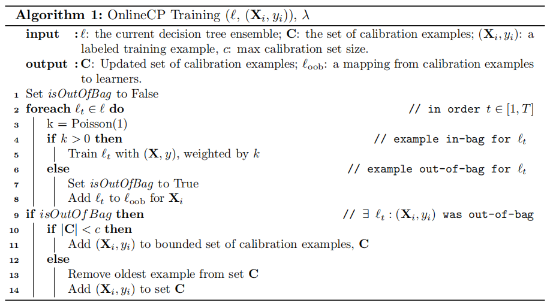
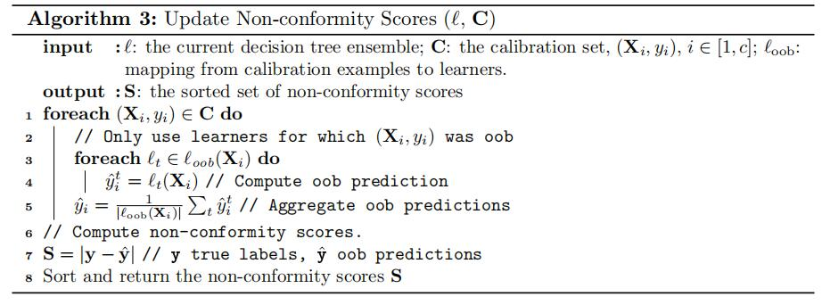
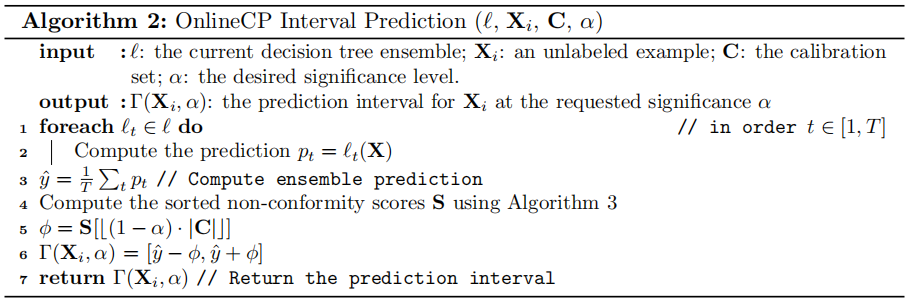
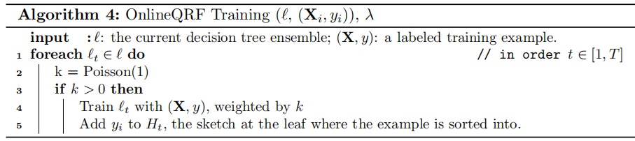

<!-- TOC -->

- [2. Background](#2-background)
  - [2.1 Problem Defined](#21-problem-defined)
  - [2.2 Inductive Conformal Prediction](#22-inductive-conformal-prediction)
  - [2.3 Quantile Regression Forests](#23-quantile-regression-forests)
- [3. Methods](#3-methods)
  - [3.1 Conformal Prediction with Online Regression Forests](#31-conformal-prediction-with-online-regression-forests)
    - [3.1.1. Algorithm Description](#311-algorithm-description)
    - [3.1.2. Optimizations](#312-optimizations)
    - [3.1.3. Approximate Algorithm](#313-approximate-algorithm)
  - [3.2 Online Quantile Regression Forests](#32-online-quantile-regression-forests)

<!-- /TOC -->

# **2. Background**

## **2.1 Problem Defined**

假设到达的数据流为$(X_i,y_i)$，都是从一些固定的基础分布中取样，其中$X_i \in \R^p$为特征向量，$y \in \R$为标签。$i \in \N^+$为一个潜在无界限数据集的下标。我们的目标是学习一个函数 $\Gamma(X_i,\alpha):\R^p \times (0,1) → [l,u]，其中 l,u\in \R 并且l\leq u$。

对于算法的描述，我们假设一个集合，它由一个含有$T$个决策树的随机的决策树森林$l$组成，每一个决策树都以$l_t , t\in [1,T]$表示。我们考虑一个区间预测器 ，如果它发生错误，当$y_i \notin \Gamma(X_i,\alpha)$发生的概率，最多不超过$\alpha$，则是**有效的 <u>$valid$</u>**。

- **Meta-algorith:** "algorithmic technique". It's a general framework that can be used to solve a number of problems.
  
- **在线学习**：数据或者观测值被模型逐一接受，模型不能一次性获得所有数据
  
- **置信区间估计 confidence interval estimate** 利用估计的回归方程，对于自变量 x 的一个给定值 x0 ，求出因变量 y 的平均值的估计区间。
- **预测区间估计 prediction interval estimate** 利用估计的回归方程，对于自变量 x 的一个给定值 x0 ，求出因变量 y 的一个个别值的估计区间。
- **置信区间（confidence interval）**，他是对于x的一个给定值，y的平均值的区间估计。
- **预测区间（prediction interval）**，他是对于x的一个给定值，y的一个个别值的区间估计。

-  **显著性水平 Significance Level**： 估计总体参数落在某一区间内，可能犯错误的概率，用α表示。在统计学中叫做犯第一类错误的大小，第一类错误就是原假设是对的，但是被拒绝的概率，我们一般把这个显著性水平α定为0.05。

- **Concept Drift**：概念漂移
    
    在预测分析和机器学习的概念漂移表示目标变量的统计特性随着时间的推移以不可预见的方式变化的现象。随着时间的推移，模型的预测精度将降低。

## **2.2 Inductive Conformal Prediction**
- **PAC：** probably approximately correct 
  
  [link1 公式](https://blog.csdn.net/wangjianguobj/article/details/57413819)
   
  [link2 理论定义](https://blog.csdn.net/rongxiang20054209/article/details/77601091)

  PAC学习框架针对的是二元分类问题（原装版），用严格的数学语言描述了可“学习”性。
- **Conformal prediction:**
  - 在每个实例的基础上提供错误界限(与PAC理论不同)。
    - 概率被很好的校刻（比如定义RMSE为0.8就为0.8）
  - 与贝叶斯学习不同，不需要知道先验概率
    - 只需要数据是exchangeable
  - 可以在所有机器学习算法中使用
  - 可以应用于在线、离线、半在线
  - 该框架经过了严格的验证，并且易于实现
  - conformal prediction 的作用前提：
    - 训练数据和测试数据属于同一个分布
    - 映射函数f(z)是无关的，但是它必须是对称的->对待测试和训练特征是相同的
    - 数据互换性(观测顺序无关)

- **Conformal prediction:**
  - **The main property of a conformal predictor** is that it is **valid**: the expected error rate is upper-bounded by a **<u>predetermined significance level</u>**.
  
  - **Transductive Conformal Prediction:** 
    - 传统的共性预测框架用于在线场景，每一个观测值都会触发一次预测，因而更新整个预测器
    - 但是需要为基础模型的每次预测结果计算**non-conformity socres**，这需要用到<u>整体数据</u>
    - **non-conformity socres**衡量"不寻常"的数据和已观察的数据之间的差距，并用来生成 **prediction intervals**
    - 对整体数据的需求使得这种算法计算效率低，需避免用于大型数据
  
  - **Inducrive Conformal Prediaction**'
    - 这种方法是针对批处理设置的，并且不需要连续重新训练基础模型
    - 在训练数据中选取一部分作为 **calibration set 校准集 $C$**，其余的训练数据用于训练批处理预测器。
    - 校准集用于产生有序的**non-conformity socres $S$**，用于产生**预测区间 the prediction intervals**。
    - 在回归中，我们通常用模型预测的绝对误差来度量一个例子的不符合性。
    - 通过扫描 non-conformity socres $S$，得到$\lfloor(1-\alpha) \cdot |S| \rfloor$
    - 令 $\phi = S [ \lfloor(1-\alpha) \cdot |S| \rfloor ]$
    - 得到**预测区间为** $\Gamma(X_i,\alpha) = [ \hat{y} - \phi, \hat{y} +\phi ]$，其中$\hat{y}$是模型对$X_i$的点预测值

## **2.3 Quantile Regression Forests**

[Quantile Regression 分位数回归](https://blog.csdn.net/jesseyule/article/details/95247155)

- Meinshausen（2006）介绍了量子回归森林（QRF），目的是将随机森林从计算**条件均值**扩展到计算**全条件累积分布函数**(the full conditional cumulative distribution function)
- 定义 the conditional CDF为：
  >  $F(y | X = x ) = P(Y \leq y | X = x) \qquad (1)$ 
- 定义 $\beta-quantile Q_\beta(x)$ 为：
  - 对于给定$x$，$Y$小于$Q_\beta(x)$的概率，恰好为$\beta$:
  > $Q_\beta(x) = inf\{y:F(y | X=x) \geq \beta \}$

  > 即$Q_\beta(x)$是 对于给定x的y大于等于Y的概率 大于等于β的 最小y值
- 通过使用条件CDF，我们能够通过计算**所需间隔端点处的分位数**来生成**预测间隔**。
- 例如，对于显著性水平significance level α=0.1的预测区间可以通过以下式子获得：
  > $\Gamma(x,\alpha) = [Q_{0.05}(x) , Q_{0.95}(x)]$

与其他分位数回归方法( **quantile regression methods**)不同，QRF不会改变底层随机森林算法的损失函数。相反，它将条件分布计算为观察到的标签在森林中的加权分布。因此，为了提供预测间隔，只需要对底层学习算法进行最小的更改。

下面简单的介绍一下**batch QRF**：
  - 这种算法用常规的RF算法生成树。但是，在每一片叶子上，它存储所有的标签值，而不仅仅是它们的平均值。
  - 每一个新的观察x都被传送到森林的所有树木上，直到它到达一片叶子为止
  - 定义叶子 $leaf(x,l_t)$为新的观察值x在树$l_t \in  l$上到达的叶子
  - 每棵树对每个样例的权重为：
    > $w_i(x,l_t) = \mathbb{1}_{X_i \in  leaf(x,l_t)} / |j: X_j \in leaf(x,l_t)|$

    > 即，已经在树$l_t$叶子上的观测值的数量的倒数

    > 为了得到整个森林的观测重量，我们平均每棵树： $w_i(x)=T^{-1} \sum^T_{t=1} w_i(x,l_t)$
  - 在标签小于或等于所要求的y的相应叶子中的所有观测值上，用加权和给出条件分布的估计值：
    > $\hat{F}(y|X=x) = \sum^N_i w_i(x)1_{Y_i \leq y}$

  - QRF是一种批处理方法，它需要事先访问完整的数据集，因为我们需要确保所有示例和的权重。
  - 为了提供对全部条件分布的访问，必须将所有N个示例的标签存储在树的叶子中，并以示例权重到相应标签的映射关系存储。
  - 当数据集大规模或无界时，这一要求会带来令人望而却步的内存成本，这使得算法不适合于在线设置。

 

# **3. Methods**

## **3.1  Conformal Prediction with Online Regression Forests**

### **3.1.1. Algorithm Description**
- **bagging：bootstrap aggregating的缩写**。让该学习算法训练多轮，每轮的训练集由从初始的训练集中随机取出n个训练样本组成，某个训练样本在某训练集中可能出现多次或者不出现，训练之后可得到一个预测函数序列h_1,h_n，也类似于一个森林。最终的预测函数H对分类问题采用投票方式，对回归问题（加权平均好点，但是没）采用简单平均方式判别。训练R个分类器f_i,分类器之间其他相同就是参数不相同。其中f_i是通过从训练集和中随机取N次样本训练得到的。对于新样本，用这个R个分类器去分类，得到最多的那个类别就是这个样本的最终类别。

- **训练算法Algorithm 1 ：** online bagging algorithm 和the out-of-bag conformal regression algorithm 的结合
- Oza观察到，对于大量样本，用于在装袋中选择样本的二项式分布趋于于Poisson（1）分布。 因此，当我们无法事先获取样品数量时，此分布可用于在线估算装袋过程。
- 给出了一个训练的例子，对于集合中的每个成员，我们从比例参数$\lambda =1$的泊松分布中提取k。如果k大于零，我们使用该示例来训练集合的成员（权重为k）。
- 如果对于森林中的某些树，k为零，则将样例添加到校准示例的有界集$C$中。该集相当于$batch$ $inductive$ $conformal prediction$的校准集。该集合保持一个固定的大小$c$，并以$FIFO$原则处理数据。在**Algorithm 3**中用于计算 **non-conformity scores**

- **Algorithm 2:** 预测算法
  - 计算和平均来自集合的每个成员的预测结果
  - 然而，为了计算间隔大小，它还需要具有最新的不合格分数，由算法3负责。
  - **Algorithm 3:**
    - 该算法以标定集$C$、当前集成 $l$ 和$l_{oob}$映射作为输入
    - non-conformity scores不符合分数的排序（升序）列表$S$作为输出
    - 与随机森林的批处理ICP一样（Johansson等人，2014a），我们的算法只使用袋外样本的树对校准集中的每个示例进行预测
    - 然后，利用 $non-conformity$ $function$ 计算non-conformity scores scores
    - 对于这部分，我们选择绝对误差作为我们的$non-conformity$ $function$，这是$conformal$ $regression$ $models$的标准选择。

  

   - 有了$non-conformity$ $scores$，最终得到计算预测间距

- 在固定校准集$C$的情况下，此版本的ICP对于所有示例产生相同的间隔大小。
- 尽管存在根据预测每个示例的难度的近似来调整区间大小的技术，但我们选择使用较简单的ICP版本。 **由于校准集会不断更新，因此间隔大小也将根据基础学习者的表现进行更新。**

- 对于本文，我们使用了**快速和增量模型树（FIMT）算法**（。FIMT是 **Very Fast Decision Tree**的拓展，它继承了**VFDT** 的内存管理特性，如：使最不有前途的叶子失活或放弃不好的属性，以保持算法的内存需求有界。它还提供一种概念漂移适应机制，允许我们的方法适应底层数据分布的变化，我们称我们这种元算法为**CPExact**

### **3.1.2. Optimizations**

在上一节中，我们提到校准示例集是有界的，也就是说，我们确保永远不必在内存中保留超过 $|C|=c$ 示例。在本篇算法中，校准示例集的大小对算法计算性能有显著的影响。

<u>在最坏的情况下，我们需要对每个校准示例进行集成预测，然后再进行区间预测。</u>

简单实现算法3的将要求集合中的每个成员对校准集中的每个（袋外）示例进行预测。然而，这一步是不必要的；

通过存储每个袋外校准示例集的学习器的预测，我们仅需要在学习器自身得到更新时更新该预测，否则我们可以使用其先前的预测。我们把这种技术叫做**预测记忆法**

尽管这种小的优化可以稍微减少所需预测的数量，但是$c$的因子仍然存在，这意味着对于自上次预测以来已更新的所有集合成员，最多需要c个新预测来计算更新的校准分数。

在我们的实现中，我们通过在集合成员中使用**并行性**来缓解这个问题，并在训练步骤完成后异步更新校准分数。 我们允许重叠计算，直到下一次调用预测函数。

### **3.1.3. Approximate Algorithm**

为了解决这个计算问题，我们使用一个近似解决方法来计算不符合分数。特别是，我们当新示例输入校准集，我们只使用从模型中得到的预测。

也就是说，无论一棵树是否已经更新，我们永远不会重新评估它对所有校准示例的预测。相反，我们只对新引入的例子做出预测，即自上次我们作出预测以来，那些被添加到校准集的例子。

随着越来越多的例子的积累，对给定示例的基本模型的预测将逐渐减少（bagging的数据取样方法）。

通过不对较老的例子进行预测，我们实现了大量的计算节省，并保持了算法的在线精神。此外，通过不断地在校准集中引入新的例子，我们确保在给定当前模式的情况下仍能准确表示示例的不符合项，称这个算法为 **$CPApproximate$**

CPApproximate有一个内在的权衡：当许多样本被用于其校准集时，它最终可能会使用几个陈旧的预测来计算间隔。正如我们在4.4节中所展示的，这种权衡对算法适应概念漂移的能力有影响。

通过保持使用与当前概念不同的分布进行的预测，该算法在调整其间隔以适应新引入的概念方面是缓慢的。这种延迟可能导致间隔不能保持所要求的错误率。

 

## **3.2  Online Quantile Regression Forests**

在2.3提到，批 $QRF$ 对于每个data point 为了为每一个样例得到权重需要完整的数据集，并且由于需要存储从样例的权重到对应的标签的映射，有极大的内存需求。

我们将算法**适应在线设置的主要思想**是使用标签值的近似表示来限制算法的内存要求并且不需要为每个例子保持一个权重。我们使用Karnin等人提出的**KLL流分位数估计  the KLL streaming quantile estimates**。（2016）存放标签值在树叶中的近似累积分布。利用Oza（2005）的在线套袋算法，结合特征子集选择方案（Gomes等人，2017年），我们提出了**OnlineQ RF（OQ RF）：提供分位数估计的在线回归森林。**

下面简单介绍一下 **KLL**。估计流分位数是数据管理中的一个既定问题。<u>这项任务是利用最小的内存和计算成本，从潜在无限实值的传入流中估计分位数值。</u>这个问题可以表述为在一个排序的n项集合中找到给定值x的近似等级。$\epsilon$近似分位数略图会返回近似等级，直到累加误差 $\epsilon n$。按照惯例，**KLL算法**给出了一个概率保证，即**产生的sketch是一个概率为$1-δ的\epsilon-$近似**（超过其执行）。

另一个重要的属性是**略图的可合并性**；这样，我们就可以并行绘制一条流的不同部分，并将部分略图合并到一个最终略图上，该略图在整个流上具有与单个略图相同的精度。这个场景在分布式环境中很常见（De Francisci Morales和Bifet，2015），我们利用这个属性将**集合中每棵树的分位数略图合并成一个分位数预测**。

**KLL**属于利用**压缩器 compactors**进行分位数估计的一类方法，这种数据结构可以存储具有相同 **权重$w$** 的 **$c$ 项**。压缩器可以先将它们的c个元素进行排序，然后丢弃奇数或偶数项，同时将剩余项的重量加倍，从而将它们压缩成c/2。多个压实器可以被链接在一起创建一个秩估计器；每个压实器以一个流为输入，并输出一个减半的流作为下一个压实器的输入，直到一个序列为止 长度为c的生成，此时可以简单地存储在内存中。

<u> For a new value x, we can estimate its approximate rank in the original stream from its rank the final sequence of c items</u>
KLL略图使用了一系列此类压缩器和采样器来处理流，并有选择地存储少量元素，该元素随流中元素数量的对数增长。该算法的唯一参数是K，它决定了算法的内存成本和精度之间的权衡。更高的K意味着更多的元素将被存储，但也更高的准确性。注意，错误 $\epsilon$ 不是由用户显式设置的，而是取决于K。

**与在线共形预测类似，OnlineQ RF是一种元算法，可以使用任何树学习算法。为了一致性，我们再次选择使用FIMT算法的变化，但这一次我们在每一片叶子上保持一个有效的分位数略图。我们在预测时使用这些略图来提供森林的预测间隔。$KLL$ 略图的参数 $K$ 是算法的唯一参数。**

虽然 $QRF$ 是条件分布的一致估计量，即当观察的数目趋近无穷时，QRF的叶子处使用的经验分布收敛到实际的条件分布，而 $Online$ $QRF$ 缺乏这种特性。确实，略图的使用在近似分布中引入了一个固定的误差，它保证小于 $\epsilon$，但却依旧是是一个常数。因此，在略图中添加观测值并不能改善实际条件分布在给定点以外的近似值。从一个不同的角度来看待这个问题：**我们不能希望用一个固定大小的略图来近似一个具有无穷小误差的任意分布。** <u>因此，**失去估计的一致性是使算法在在线设置中可行的必要牺牲**</u>

算法4描述了$Online$ $QRF$的训练步骤，类似于Oza对袋装学习者的原始训练。然而，我们修改了底层的学习器，以维护标签的在线分位数略图。在用样例$（X_i，y_i)$更新学习器后，我们将标签 $y_i$ 添加到叶子处相应的略图中，这是一个常数的时间操作。

算法5描述了 $Online$ $QRF$ 的预测过程。与原来的 $QRF$ 算法不同， $QRF算法$ 需要对所有数据点进行求和。我们的算法只需要 $T -1$ 的合并操作和一个操作来计算分位数，两者都只需要常数的时间。

由于略图的在线性质，我们能够逐步合并它们，从而保持算法的恒定内存需求。

此外，在并行执行算法时，我们可以使用并行还原操作，从而进一步减少预测操作的运行时，其中草图合并为最昂贵的操作。考虑到合并操作是算法最耗时的操作，我们还实验了近似的替代方法，例如分别计算每个草图的分位数 均结果，但所产生的间隔没用。这一结果表明，需要聚合来自所有树的信息，以便该算法按预期工作，$batch$ $QRFs$也是如此。

**$online$ $QRF$与在线共形预测方法为这项工作开发共享的一个积极特征是，从不需要一开始就设置显着性水平α。相反，它是用户在进行预测时可以设置的运行时参数。因此，用户也可以尝试多个显着性级别，而不需要训练单独的模型，这在修改损失函数的QR算法中是必要的，例如线性QR算法。**